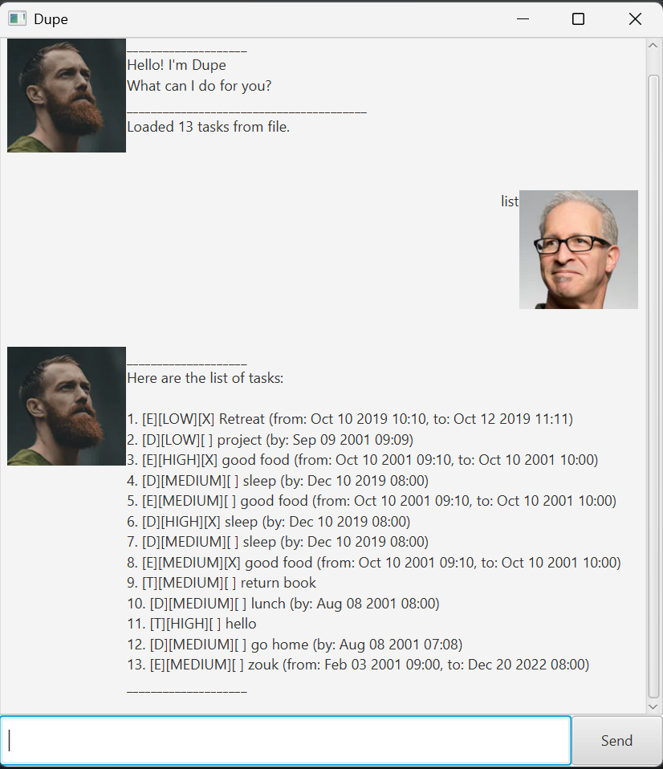

# Dupe User Guide

Dupe is a one-stop shop to help you organise all your messy problems. 
It's a simple yet **powerful** task manager the lets you keep track of your to-dos,
deadlines, and events in one place!

## Features
### Adding a task: `todo`,`deadline`,`event`
Adds a task to task list. There are 3 different types of tasks.
  

#### Adding a `todo` task
Format: `todo (description)`

Example:
* `todo homework`
  

#### Adding a `deadline` task
Format: `deadline (description) /by (datetime)`
* The `datetime` follows: `dd-MM-yyyy HH:mm` format
* e.g. `08-08-2001 09:10` 

Example:
* `deadline assignment /by 10-09-2025 23:59`
  

#### Adding a `event` task
Format: `event (description) /from (datetime) /to (deadtime)`
* The `datetime` follows: `dd-MM-yyyy HH:mm` format
* e.g. `08-08-2001 09:10`

Example:
* `event orientation camp /from 01-10-2025 10:00 /to 05-10-2025 12:00`
    

### List all task: `list`
Display the list of task in the task list.
Format: `list`
  

### Delete a task: `delete`
Delete a specific task from the task list based on the index.
Format: `delete (index)`
* The `index` must be from `1` to `total number of task` shown in the task list.
  

### Mark a task: `mark`
mark a specific task from the task list based on the index.
Format: `mark (index)`
* The `index` must be from `1` to `total number of task` shown in the task list.
    

### Unmark a task: `unmark`
Unmark a specific task from the task list based on the index.
Format: `unmark (index)`
* The `index` must be from `1` to `total number of task` shown in the task list.
    

### Find tasks by keyword: `find`
Finds task from the task list that contains the specified keyword in the task description.
Format: `find (keyword)`
* The search is case-sensitive. 
* The `keyword` must be in the task description.
  

### Set priority of a task: `setPriority`
Unmark a specific task from the task list based on the index.
Format: `setPriority (priority) (index)`
* The `priority` follows: `LOW`, `MEDIUM`, `HIGH` format.
* The default priority of added task is `MEDIUM`.
* The index must be from `1` to `total number of task` shown in the task list.
    

### Exiting the program: `bye`
Exits the program.
Format: `bye`
  

### Saving the data
Dupe automatically saves the data in the hard disk after every change. 
